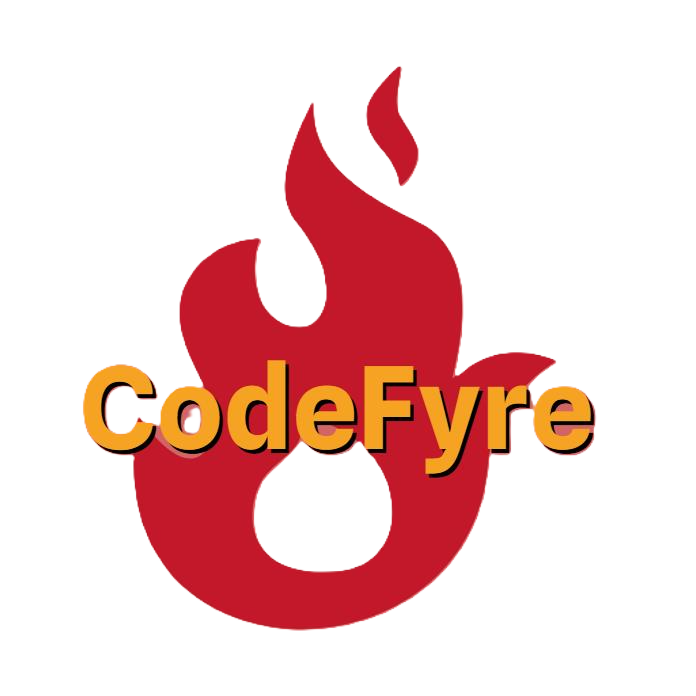

<h1 align="center"><em>🔥 Team Codefyre 🔥</em> </h1>

## 📋 Description
### <em>We are Team Codefyre.Our mission is to build an interactive system that supports fire safety operations. The platform helps teams respond faster, manage crews and vehicles, and stay ready through reports and training tools.</em>

## 🚀 Languages
 

## 🎨Design
 

## 👥 Our crew

| **Name** | **Role** | **Grade** |
| :---:   | :---: | :---: |
| Borimir Kirov | Scrum trainer | 🟥 9B |
| Milen Vasilev | Front - End Developer  | 🟩 9V  |
| Dimitar Meshkov | Back - End developer  | 🟦 9G|
| Kiril Gilichev | Designer  | 🟨 9B |

<h2 id="download">Download</h2>

If you enjoyed what you saw you can also clone our project for further expection. Enjoy!

<pre align="center">git clone "https://github.com/codingburgas/9th-grade-html-project-codefyre.git"</pre>

